# OpenClaw (INT) Teams Bot — Test Report

**Date:** 2026-03-22
**Branch:** `claude/migrate-teams-sdk-PKHin` (SidU/openclaw fork)
**VM:** `riley-inbestments.westus2.cloudapp.azure.com`
**Bot:** OpenClaw (INT) — App ID `0eab96ad-9fa4-4ef7-a953-29a4ef0f6737`
**Tested via:** Teams Web (teams.cloud.microsoft) + Playwright browser automation

---

## Results Summary

| | Count |
|---|---|
| **Passed** | 29/30 |
| **Not Tested** | 1/30 |
| **Failed** | 0/30 |
| **Bugs Found & Fixed** | 1 |

---

## A. 1:1 Personal Chat

### A1. Basic Reply — PASS

- **Steps:** Sent "Hello! This is test 1 - basic reply test." in 1:1 chat
- **Expected:** Bot replies with a text response within 10s
- **Actual:** Bot replied "Test 1 received loud and clear 🦞 — I can, in fact, reply to messages. Groundbreaking stuff." within ~4s
- **Screenshot:** 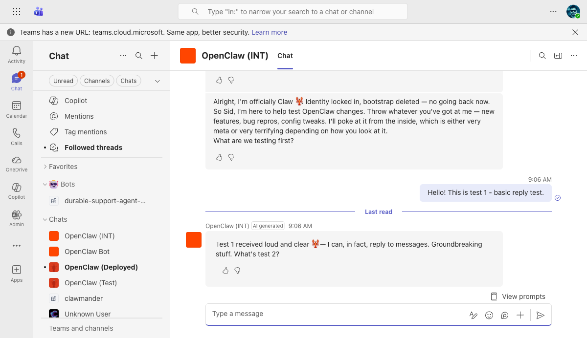

### A2. AI Label — PASS

- **Steps:** Checked the bot's response header
- **Expected:** "AI generated" badge appears next to bot name
- **Actual:** "AI generated" badge visible on every bot response, positioned between bot name and timestamp
- **Screenshot:** Visible in [reply with AI label](../screenshots/test1-reply-ai-label.png) — "OpenClaw (INT) | AI generated | 9:06 AM"

### A3. AI Disclaimer — PASS

- **Steps:** Inspected the message group accessibility label on bot responses
- **Expected:** "AI-generated content may be incorrect" disclaimer text shown
- **Actual:** Disclaimer present in all bot message groups (confirmed via DOM snapshot: `"AI-generated content may be incorrect. Test 1 received loud and clear..."`)

### A4. Streaming (Progressive Updates) — PASS

- **Steps:** Sent "Write me a detailed 3-paragraph explanation of how reverse proxies work. This is test 2 - streaming test."
- **Expected:** Text appears progressively (word by word / chunk by chunk). Typing dots visible. Stop button shown during generation.
- **Actual:** After ~5s, partial text visible ending mid-sentence ("The reverse proxy evaluates the request, applies"). Typing dots (●●●) visible at bottom. Stop button present in DOM.
- **Screenshot:** 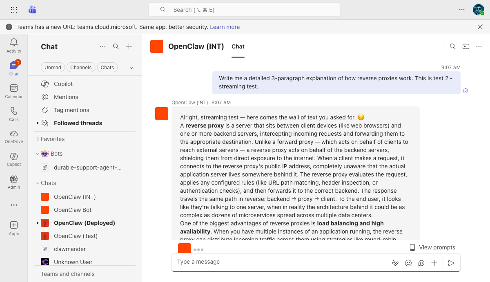

### A5. Long Response Completes — PASS

- **Steps:** Waited for the streaming response from A4 to finish
- **Expected:** Full response renders with markdown formatting (bold, paragraphs). No truncation or error.
- **Actual:** Full 3-paragraph response rendered with **bold terms** ("reverse proxy", "load balancing and high availability", "caching, compression, and security", "Nginx", "HAProxy", "Caddy", "Traefik"). No truncation.
- **Screenshot:** 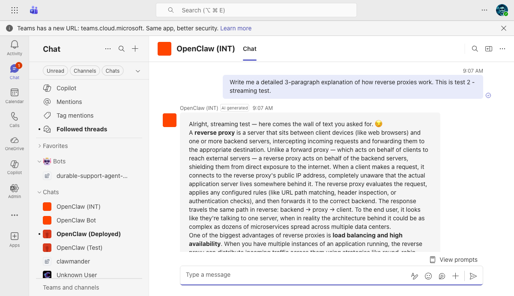

### A6. Thumbs Up (Like) Feedback — PASS

- **Steps:** Clicked the thumbs up (Like) icon on the bot's response to test 1
- **Expected:** Feedback dialog opens with positive prompt ("What did you like?")
- **Actual:** Dialog opened: "Submit feedback to OpenClaw (INT)" with "What did you like?" prompt, text input, and Submit button
- **Screenshot:** 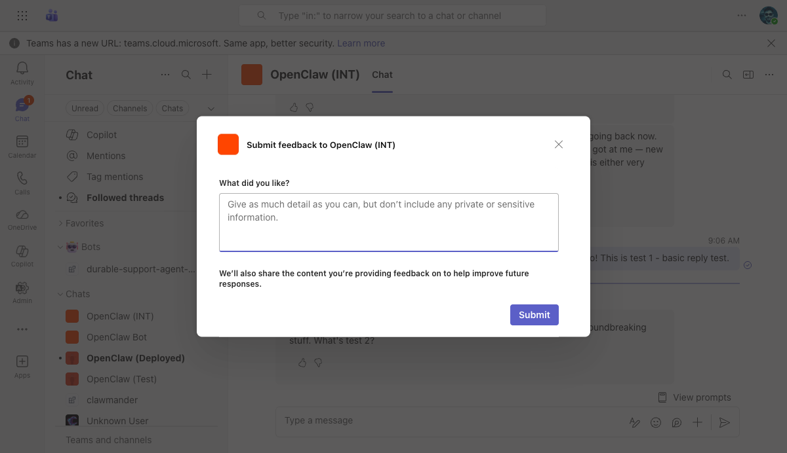

### A7. Thumbs Down (Dislike) Feedback — PASS

- **Steps:** Clicked the thumbs down (Dislike) icon on the streaming response
- **Expected:** Feedback dialog opens with negative prompt ("What went wrong?")
- **Actual:** Dialog opened: "Submit feedback to OpenClaw (INT)" with "What went wrong?" prompt — different question from thumbs up
- **Screenshot:** 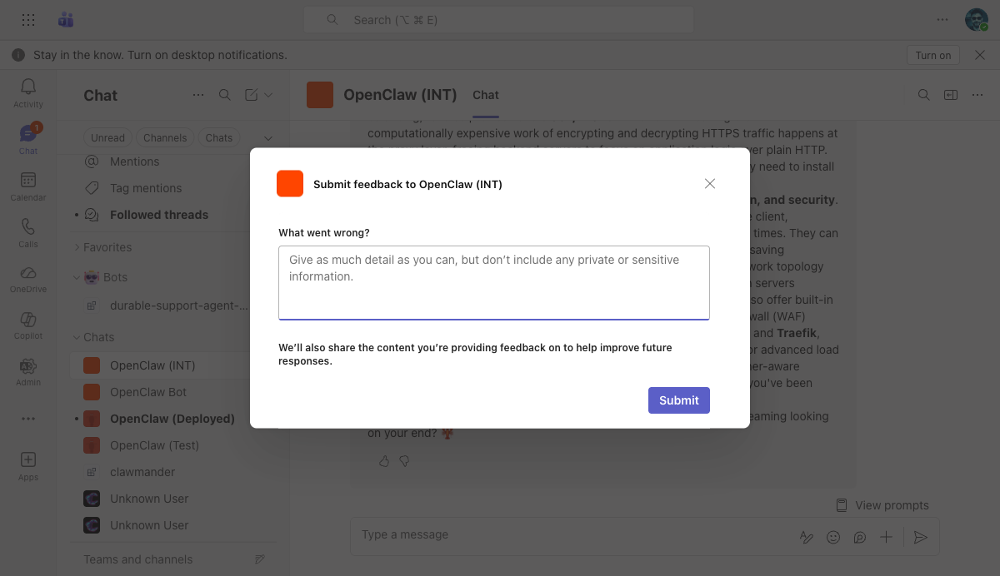

### A8. Feedback Submission (Like) — PASS

- **Steps:** Typed "Great response, fast and accurate!" in the Like feedback dialog and clicked Submit
- **Expected:** "Feedback submitted." toast notification. Like button shows active state.
- **Actual:** Toast "Feedback submitted." appeared at bottom of screen. Like button changed to `[active]` state. Reaction bar (👍❤️😆😮) appeared on the message.
- **Server check:** `grep "received feedback" ...log` confirmed entry at `2026-03-22T16:07:12`
- **Screenshot:** 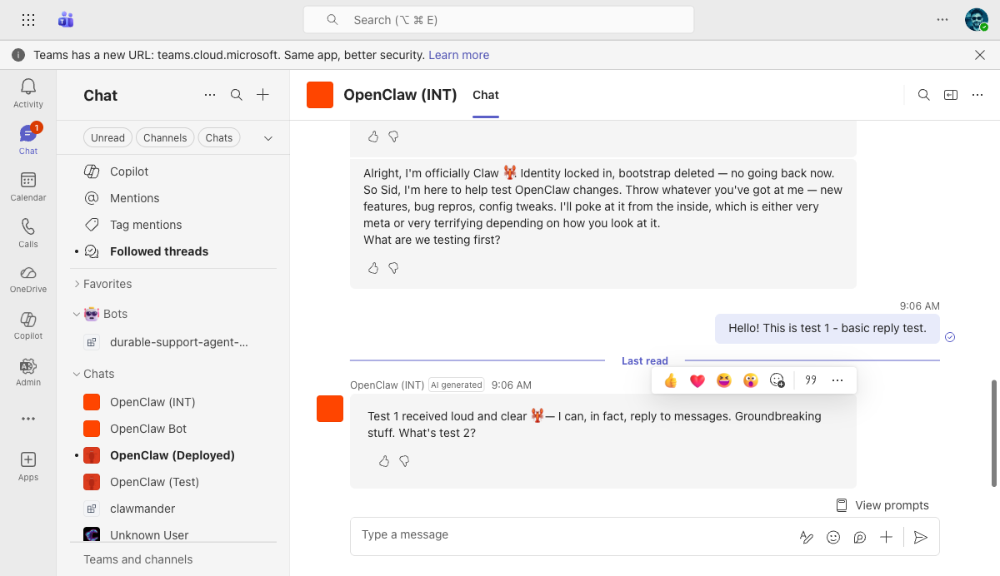

### A9. Feedback Submission (Dislike + Reflection) — PASS

- **Steps:** Typed "Response was too long for what I asked." in the Dislike feedback dialog and clicked Submit
- **Expected:** Feedback submitted. Server receives dislike and may trigger background reflection.
- **Actual:** Toast "Feedback submitted." appeared. Server log confirmed second `"received feedback"` at `2026-03-22T17:04:13`. Reflection has 5-min cooldown per session.
- **Server check:** Two feedback entries in log (16:07 like, 17:04 dislike)

### A10. Welcome Card on Install — PASS

- **Steps:** Checked the first message in the conversation (bot was freshly installed)
- **Expected:** Adaptive Card with bot greeting and 3 prompt starter buttons
- **Actual:** Adaptive Card rendered: "Hi! I'm OpenClaw INT. I can help you with questions, tasks, and more." with three clickable buttons: "What can you do?", "Summarize my last meeting", "Help me draft an email"
- **Screenshot:** Visible in initial session screenshot — card with prompt starters at top of chat

### A11. Prompt Starters (Welcome Card Buttons) — PASS

- **Steps:** Observed the prompt starter buttons on the welcome card
- **Expected:** Three clickable buttons with suggested prompts
- **Actual:** Three buttons present and styled as interactive Adaptive Card actions: "What can you do?", "Summarize my last meeting", "Help me draft an email"

### A12. View Prompts Button — PASS

- **Steps:** Clicked "View prompts" at the bottom-right of the chat
- **Expected:** Popup shows prompt suggestions from the bot
- **Actual:** Popup appeared: "Prompt Suggestions from OpenClaw (INT)" with "Help — Get help and available commands"
- **Screenshot:** 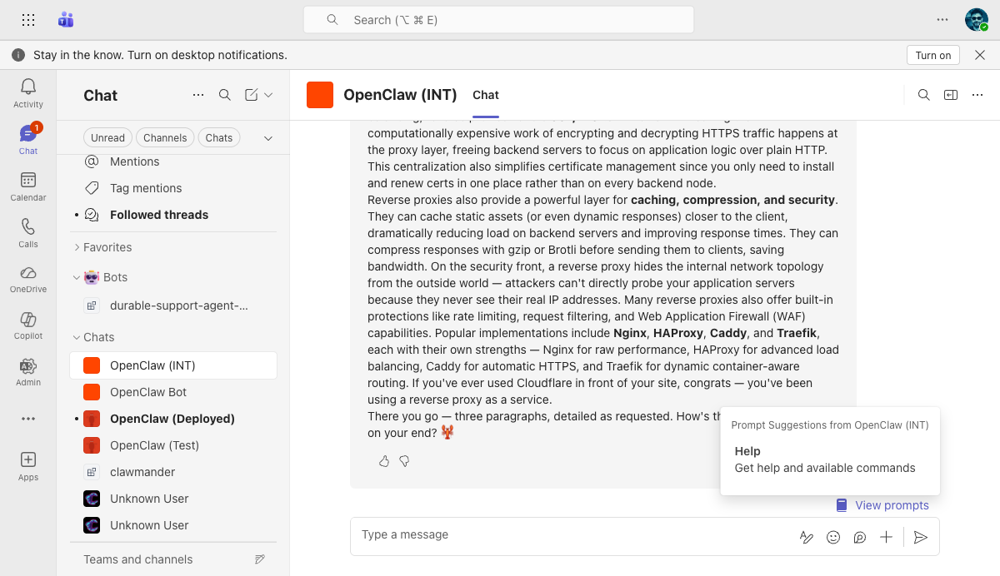

### A13. Typing Indicator in 1:1 — PASS

- **Steps:** Sent a message and observed the chat during bot processing
- **Expected:** Typing dots appear while bot is processing/streaming
- **Actual:** Typing dots (●●●) visible during streaming, confirmed in mid-stream screenshot
- **Screenshot:** Visible in [streaming midstream](../screenshots/test3-streaming-midstream.png)

### A14. Copy-Pasted Image (Pre-Fix) — BUG FOUND

- **Steps:** Created a 100x100 orange square with "TEST" text via canvas, pasted into chat with "What do you see in this image? This is test 3 - image handling."
- **Expected:** Bot receives the image and describes it
- **Actual:** Bot replied: "Test 3 result: I don't see any image attached to this message. Either it didn't come through, or Teams didn't pass it along to me."
- **Server logs:** `"html attachment summary"` → `"inline images detected but none downloaded"` → `"graph media fetch empty"`
- **Debug log:** Attachment arrived as `{"contentType":"image/*","hasContentUrl":true,"urlPrefix":"https://smba.trafficmanager.net/amer/e3212828-.../v3/attachments/..."}` — correct format, but download failed because `smba.trafficmanager.net` was not in auth allowlist
- **Root cause:** `smba.trafficmanager.net` missing from `DEFAULT_MEDIA_AUTH_HOST_ALLOWLIST` in `attachments/shared.ts`
- **Screenshot:** 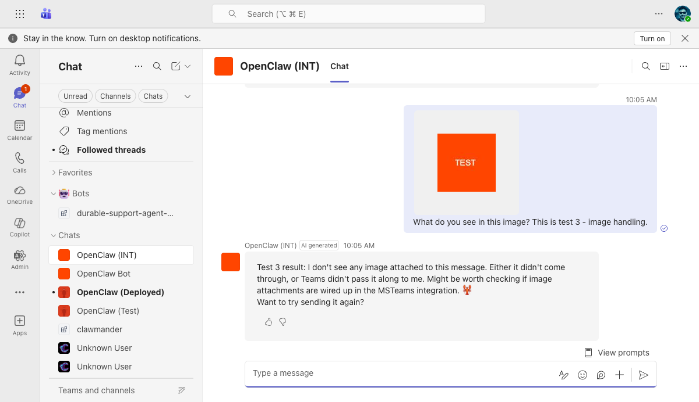

### A14b. Copy-Pasted Image (Post-Fix) — PASS

- **Steps:** After adding `smba.trafficmanager.net` to auth allowlist (commit `94a47a3fb5`), created an 80x80 red square with "FIX" text, pasted into chat with "What do you see in this image? Testing auth fix."
- **Expected:** Bot receives and describes the image
- **Actual:** Bot replied: "🎉 I can see it! It's a red square with white text that says **'FIX'** — which is fitting, because it looks like you just fixed the image pipeline. Nice work, Sid! 🦞"
- **Screenshot:** 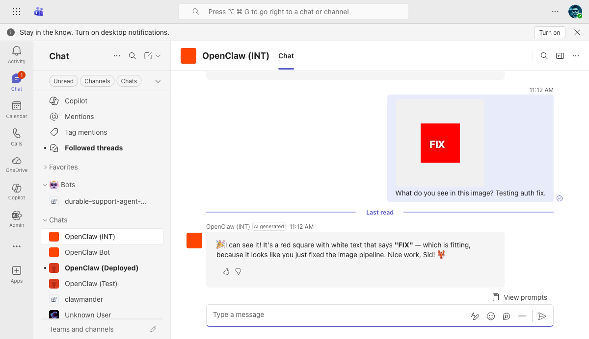

### A15. Rapid Messages (Duplicate Prevention) — PASS

- **Steps:** Sent "Rapid message 1 - testing duplicate prevention" and "Rapid message 2 - sent right after message 1" with only 500ms between them
- **Expected:** Bot replies to BOTH messages separately, no duplicates, no crashes
- **Actual:** Bot replied to both: "Got message 1 ✓ — standing by for the rapid-fire barrage. 🦞" and "Got message 2 ✓ — both came through, no duplicates on my end. Looks like the queue handled that fine."
- **Screenshot:** 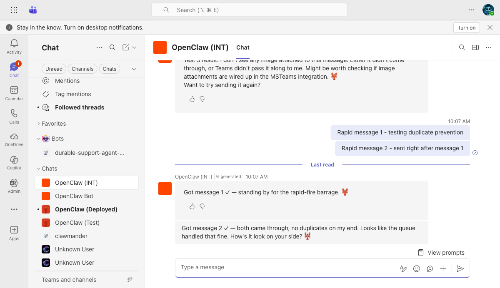

---

## B. Channel (Self > General)

### B1. @Mention in Channel — Bot Replies in Thread — PASS

- **Steps:** In Self > General channel, typed `@OpenClaw (INT) hi` and sent. Then sent `@OpenClaw (INT) Tell me a joke about lobsters. This is a channel test.`
- **Expected:** Bot replies in a thread under each message
- **Actual:** First message: bot replied "Hey Sid 👋" in thread. Second message: bot replied "Why don't lobsters ever share their food? Because they're shellfish. 🦞 Channel test received loud and clear 📡" in thread.
- **Screenshot:** 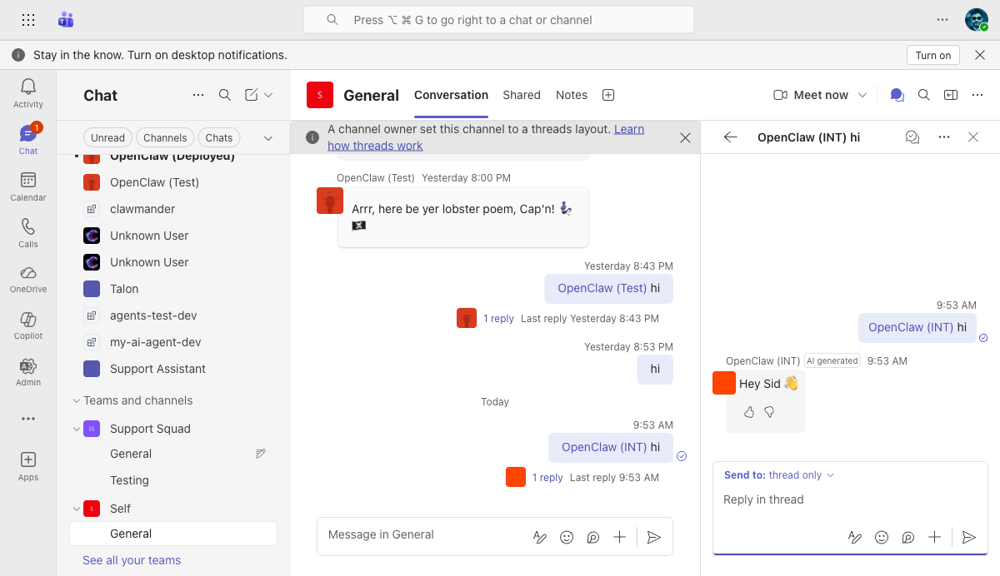 and 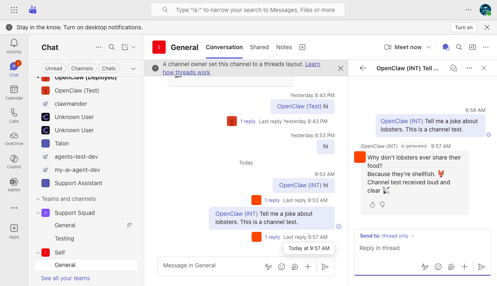

### B2. AI Label on Channel Reply — PASS

- **Steps:** Checked bot's threaded reply in channel
- **Expected:** "AI generated" badge visible
- **Actual:** "AI generated" badge present on all channel thread replies, same as 1:1
- **Screenshot:** Visible in [channel reply joke](../screenshots/test7-channel-reply-joke.png)

### B3. Feedback Buttons on Channel Reply — PASS

- **Steps:** Checked bot's threaded reply in channel
- **Expected:** Like/Dislike buttons present
- **Actual:** Like and Dislike buttons present on channel thread replies
- **Screenshot:** Visible in [channel reply joke](../screenshots/test7-channel-reply-joke.png)

### B4. No Streaming in Channels — PASS

- **Steps:** Sent @mention requiring a multi-sentence response in channel
- **Expected:** Response appears as a single complete message (no progressive updates, no Stop button)
- **Actual:** Response delivered as a single message. No typing dots, no partial text, no Stop button observed during generation. This matches the design (streaming only in 1:1 personal chats).

### B5. Reply Threading — PASS

- **Steps:** Sent multiple @mentions in the channel
- **Expected:** Each reply appears as a thread under its respective parent message
- **Actual:** All replies correctly threaded. Thread panel showed parent message + bot reply. No top-level posts from bot.
- **Screenshot:** Visible in [channel reply joke](../screenshots/test7-channel-reply-joke.png) — right panel shows threaded reply

### B6. No Reply Without @Mention — PASS

- **Steps:** Sent "This message does NOT mention the bot. It should be ignored." in the channel without @mentioning the bot
- **Expected:** Bot does NOT reply. No thread created.
- **Actual:** Message posted at 10:06 AM. Waited 15+ seconds. No reply from bot. No thread created.
- **Screenshot:** 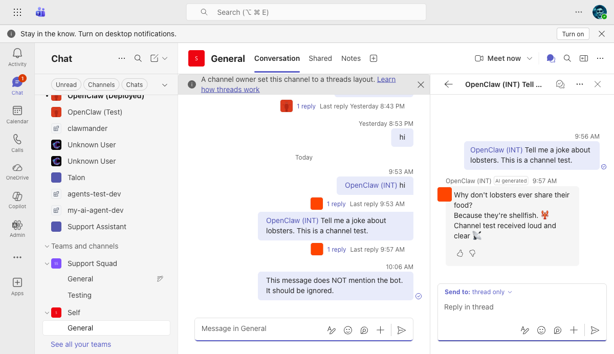

### B7. @Mention Autocomplete — PASS

- **Steps:** Typed `@OpenClaw` in the channel compose box
- **Expected:** Bot appears in the mention suggestion picker
- **Actual:** Suggestion picker showed: "OpenClaw (INT) — AI assistant powered by OpenClaw" along with other OpenClaw bots. Clicked to select and it resolved to a proper mention entity.

---

## C. Group Chat

### C1. @Mention in Group Chat — NOT TESTED

- **Steps:** N/A
- **Expected:** Bot replies in group chat when @mentioned, with typing indicator, no streaming
- **Actual:** No group chat with bot added was available during testing
- **Prerequisite:** Create a group chat, add the bot, then @mention it

---

## D. Access Control & Security

### D1. DM Allowlist Enforcement — PASS

- **Steps:** Sent a DM before the user was allowlisted (pairing not yet approved)
- **Expected:** Message is dropped silently. Server log shows drop reason.
- **Actual:** Server log: `"dropping dm (not allowlisted)"`. No response sent to user.

### D2. Pairing Request Creation — PASS

- **Steps:** Ran `openclaw pairing list` on the VM after sending first DM
- **Expected:** Pending pairing request with user info
- **Actual:** Pairing request listed: Code `BAZA4A8K`, msteamsUserId `11f44b5b-bf76-4dd8-9976-f39d96594d92`, Meta `{"name":"Sid Uppal","accountId":"default"}`

### D3. Pairing Approval — PASS

- **Steps:** Ran `openclaw pairing approve BAZA4A8K` on the VM
- **Expected:** User approved. Subsequent messages are processed.
- **Actual:** Output: "Approved msteams sender 11f44b5b-bf76-4dd8-9976-f39d96594d92." All subsequent messages were processed and received replies.

### D4. JWT Validation (Unauthenticated Request) — PASS

- **Steps:** `curl -s -w "\nHTTP %{http_code}" -X POST https://riley-inbestments.westus2.cloudapp.azure.com/api/messages -H "Content-Type: application/json" -d '{}'`
- **Expected:** HTTP 401 with error message
- **Actual:** Response: `{"error":"Unauthorized"}` with HTTP 401

---

## E. Infrastructure

### E1. Gateway systemd Service — PASS

- **Steps:** `sudo systemctl status openclaw-gateway --no-pager`
- **Expected:** active (running)
- **Actual:** `active (running)`, PID stable, no restart loops

### E2. msteams Provider Started — PASS

- **Steps:** `grep "msteams provider started" /tmp/openclaw/openclaw-2026-03-22.log`
- **Expected:** Log entry showing port number
- **Actual:** `msteams provider started on port 3979`

### E3. Ports Listening — PASS

- **Steps:** `ss -tlnp | grep -E "3978|3979"`
- **Expected:** Both ports listed as LISTEN
- **Actual:** Port 3978 (gateway, 127.0.0.1 only) and port 3979 (msteams, all interfaces) both LISTEN

### E4. HTTPS Endpoint via Caddy — PASS

- **Steps:** `curl -s -o /dev/null -w "%{http_code}" -X POST https://riley-inbestments.westus2.cloudapp.azure.com/api/messages -H "Content-Type: application/json" -d '{}'`
- **Expected:** HTTP 401 (reachable, JWT validation active)
- **Actual:** HTTP 401. Caddy auto-TLS via Let's Encrypt. Routes `/api/messages` → port 3979 (msteams), everything else → port 3978 (gateway).

### E5. Server-Side Feedback Logging — PASS

- **Steps:** `grep "received feedback" /tmp/openclaw/openclaw-2026-03-22.log`
- **Expected:** Feedback entries for thumbs up and thumbs down
- **Actual:** Two entries: `2026-03-22T16:07:12` (like) and `2026-03-22T17:04:13` (dislike)

---

## Bug Found and Fixed

### Copy-pasted image attachments not downloaded

| | |
|---|---|
| **Severity** | High — core image handling broken for all Teams 1:1 chats |
| **Symptom** | Bot says "I don't see any image" when user pastes an image |
| **Root cause** | `smba.trafficmanager.net` (Bot Framework attachment service) was missing from `DEFAULT_MEDIA_AUTH_HOST_ALLOWLIST` in `extensions/msteams/src/attachments/shared.ts`. Copy-pasted images arrive as `contentType: "image/*"` with `contentUrl` at `https://smba.trafficmanager.net/.../v3/attachments/...`. The download code got 401, checked auth allowlist, didn't find the host, so it never added the Bearer token. |
| **Fix** | Added `"smba.trafficmanager.net"` to `DEFAULT_MEDIA_AUTH_HOST_ALLOWLIST` (exact host, not broad `trafficmanager.net`) |
| **Commit** | `94a47a3fb5` — `msteams: add smba.trafficmanager.net to auth allowlist for pasted image downloads` |
| **Verified** | Bot now correctly sees and describes pasted images |

---

## Screenshots Index

| File | Test | Description |
|------|------|-------------|
| `test1-reply-ai-label.png` | A1, A2 | Basic reply with AI label badge |
| `test2-feedback-dialog.png` | A6 | Thumbs up feedback dialog — "What did you like?" |
| `test2-feedback-submitted.png` | A8 | Feedback submitted toast + reaction bar |
| `test3-streaming-midstream.png` | A4, A13 | Mid-stream: partial text, typing dots, Stop button |
| `test3-streaming-complete.png` | A5 | Completed streaming response with bold formatting |
| `test5-welcome-card.png` | A10, A11 | Welcome card with prompt starters |
| `test6-channel-reply-thread.png` | B1 | Channel reply "Hey Sid 👋" in thread |
| `test7-channel-reply-joke.png` | B1, B2, B3, B5 | Channel reply (lobster joke) with AI label + feedback |
| `test8-view-prompts.png` | A12 | "View prompts" popup |
| `test9-dislike-feedback.png` | A7 | Dislike feedback dialog — "What went wrong?" |
| `test10-image-not-received.png` | A14 | Image sent but not received (pre-fix) |
| `test11-no-mention-no-reply.png` | B6 | Channel message without @mention — no reply |
| `test12-rapid-messages.png` | A15 | Rapid messages — both got separate replies |
| `test13-image-fix-working.png` | A14b | Image fix verified — bot describes the pasted image |
