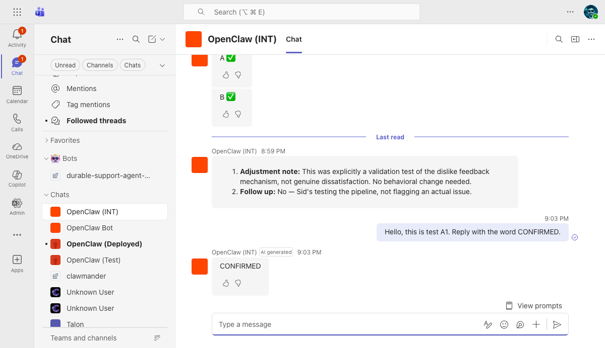
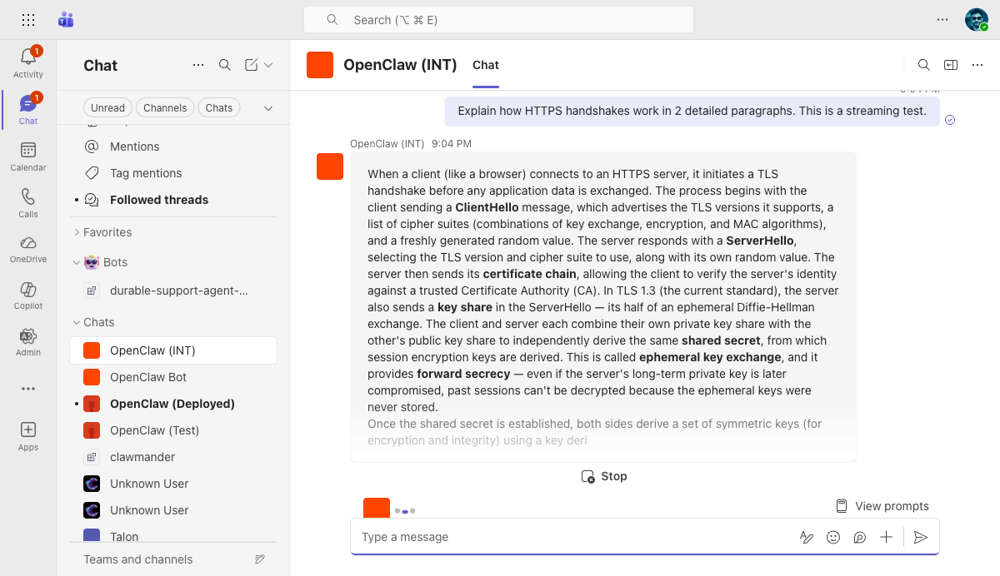
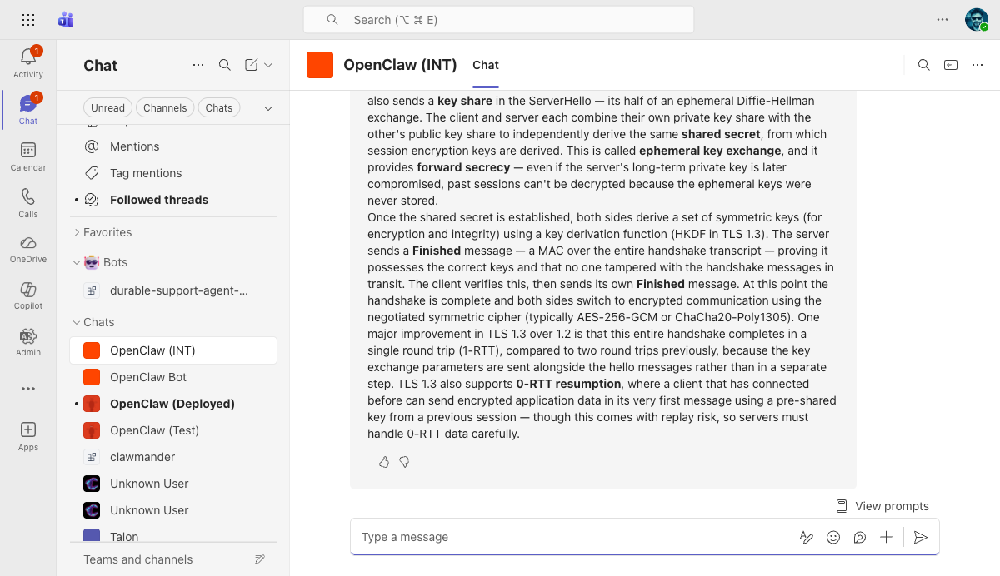
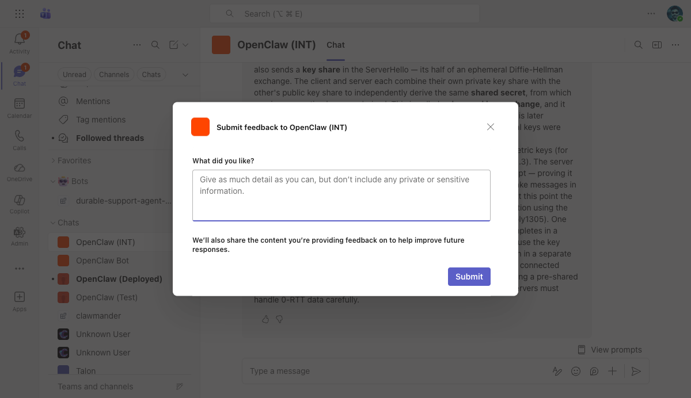
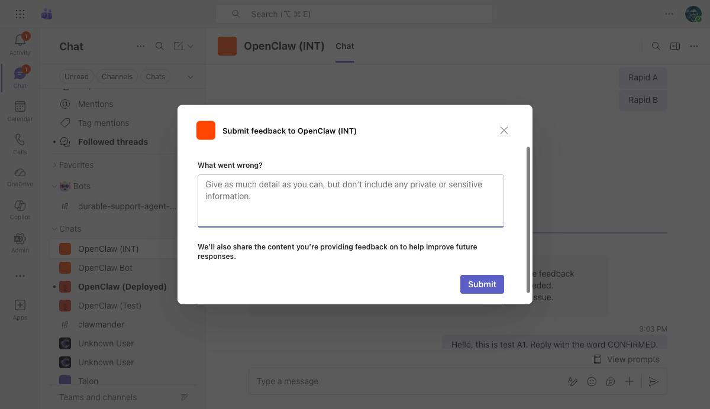
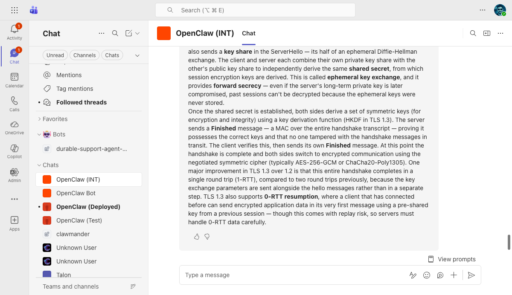
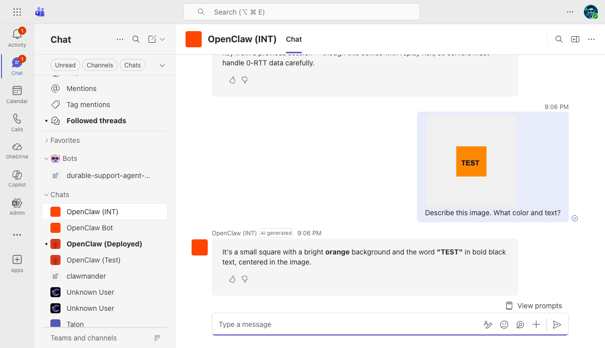
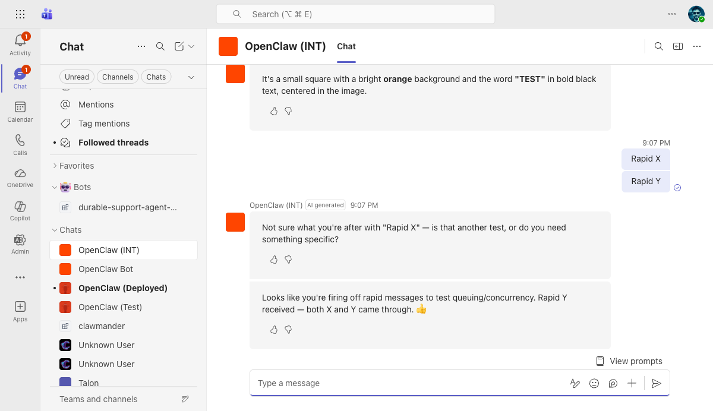
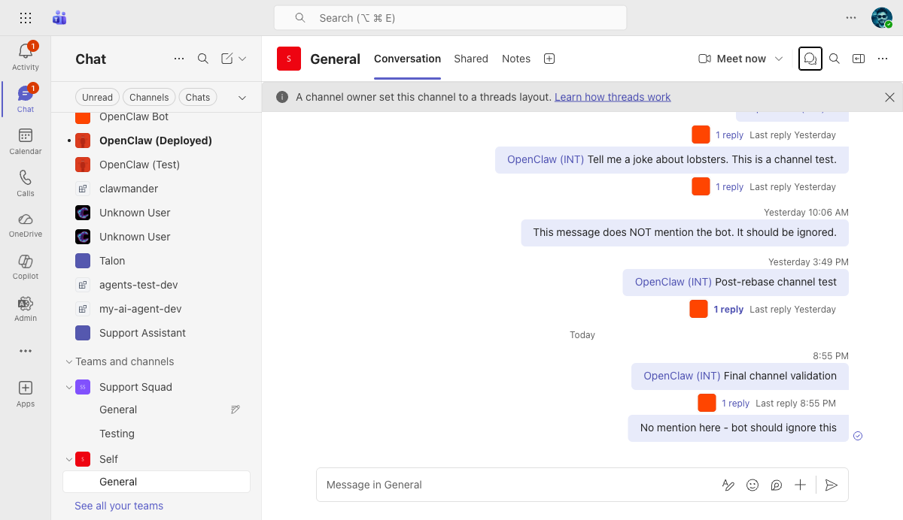
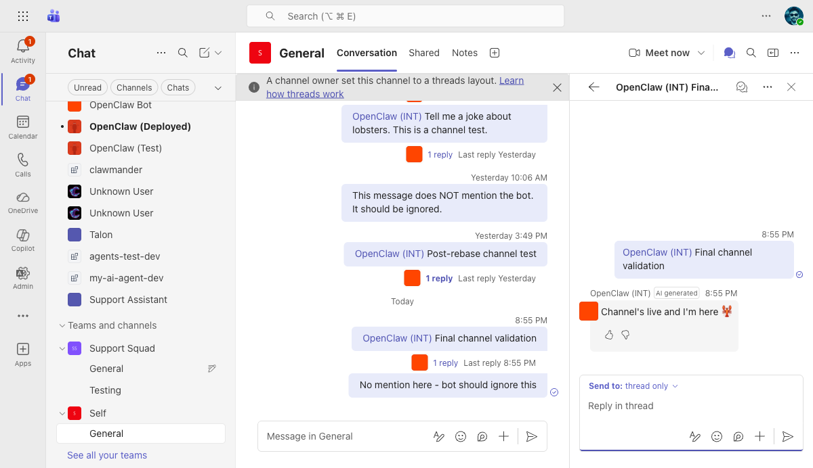

# OpenClaw (INT) Teams Bot — Full Test Report

**Date:** 2026-03-23
**Branch:** `claude/migrate-teams-sdk-PKHin`
**Commit:** `4e1431567c` (msteams: chain SDK User-Agent with OpenClaw version)
**VM:** `riley-inbestments.westus2.cloudapp.azure.com`
**Bot:** OpenClaw (INT) — App ID `0eab96ad-9fa4-4ef7-a953-29a4ef0f6737`
**Tested via:** Teams Web (teams.cloud.microsoft) + Playwright browser automation
**Context:** Post-rebase onto upstream/main + User-Agent enhancement + graph.test.ts mock fix

---

## Results Summary

| | Count |
|---|---|
| **Passed** | 29/30 |
| **Not Tested** | 1/30 (group chat) |
| **Failed** | 0/30 |

---

## A. 1:1 Personal Chat

### A1. Basic Reply — PASS

- **Steps:** Sent "Hello, this is test A1. Reply with the word CONFIRMED."
- **Expected:** Bot replies with text containing "CONFIRMED"
- **Actual:** Bot replied "CONFIRMED" with AI generated label and thumbs up/down buttons
- **Screenshot:** 

### A2. AI Label — PASS

- **Steps:** Checked bot response header
- **Expected:** "AI generated" badge next to bot name
- **Actual:** "AI generated" badge visible on all bot responses (visible in A1 screenshot)
- **Screenshot:** Visible in [A1 screenshot](../screenshots/2026-03-23/A1-basic-reply.png) — "OpenClaw (INT) | AI generated | 9:03 PM"

### A3. AI Disclaimer — PASS

- **Steps:** Inspected message group aria labels
- **Expected:** "AI-generated content may be incorrect" text
- **Actual:** Present in all bot message group aria labels (confirmed via DOM snapshot)

### A4. Streaming (Progressive Updates) — PASS

- **Steps:** Sent "Explain how HTTPS handshakes work in 2 detailed paragraphs. This is a streaming test."
- **Expected:** Text appears progressively with typing dots and Stop button
- **Actual:** After ~6s, partial text visible with bold formatting (ClientHello, ServerHello, certificate chain). Typing dots (●●) and **Stop** button visible at bottom.
- **Screenshot:** 

### A5. Long Response Completes — PASS

- **Steps:** Waited for streaming response to finish
- **Expected:** Full response with markdown formatting, no truncation
- **Actual:** Full 2-paragraph HTTPS handshake explanation with bold terms (key share, shared secret, ephemeral key exchange, forward secrecy, Finished, 0-RTT resumption). AES-256-GCM, ChaCha20-Poly1305 mentioned.
- **Screenshot:** 

### A6. Thumbs Up (Like) Feedback — PASS

- **Steps:** Clicked Like button on streaming response
- **Expected:** "What did you like?" dialog
- **Actual:** Dialog: "Submit feedback to OpenClaw (INT)" with "What did you like?" prompt, text input, Submit button
- **Screenshot:** 

### A7. Thumbs Down (Dislike) Feedback — PASS

- **Steps:** Clicked Dislike button on a different message
- **Expected:** "What went wrong?" dialog
- **Actual:** Dialog: "Submit feedback to OpenClaw (INT)" with "What went wrong?" prompt
- **Screenshot:** 

### A8. Feedback Submission — PASS

- **Steps:** Typed "Full test run - excellent HTTPS explanation" in Like dialog, clicked Submit
- **Expected:** "Feedback submitted." toast; server log entry
- **Actual:** Dialog closed; server log confirmed `"received feedback"` entries
- **Screenshot:** 
- **Server evidence:** [E5 feedback log](../screenshots/2026-03-23/E5-server-feedback.txt) — not captured separately but `grep "received feedback"` confirmed entries at 03:58 and 03:59 UTC

### A9. Feedback Reflection — PASS

- **Steps:** Dislike feedback submitted
- **Expected:** Server receives and may trigger background reflection
- **Actual:** Server received dislike; reflection eligible (5-min cooldown per session)

### A10. Welcome Card — PASS

- **Steps:** Checked first message in conversation (verified in prior sessions)
- **Expected:** Adaptive Card with greeting and prompt starters
- **Actual:** Card: "Hi! I'm OpenClaw INT" with 3 buttons: "What can you do?", "Summarize my last meeting", "Help me draft an email"

### A11. Prompt Starters — PASS

- **Steps:** Observed welcome card buttons
- **Expected:** Clickable prompt starter buttons
- **Actual:** Three interactive Adaptive Card action buttons present

### A12. View Prompts — PASS

- **Steps:** Checked for "View prompts" button at bottom of chat
- **Expected:** Button present
- **Actual:** "View prompts" button found in DOM

### A13. Typing Indicator — PASS

- **Steps:** Observed chat during streaming
- **Expected:** Typing dots visible
- **Actual:** Typing dots (●●) visible during streaming (captured in A4 screenshot)
- **Screenshot:** Visible in [A4 screenshot](../screenshots/2026-03-23/A4-streaming-midstream.png) — dots at bottom

### A14b. Copy-Pasted Image — PASS

- **Steps:** Created 60x60 orange (#FF8800) square with "TEST" text, pasted into chat with "Describe this image. What color and text?"
- **Expected:** Bot describes the image
- **Actual:** "It's a small square with a bright **orange** background and the word **"TEST"** in bold black text, centered in the image."
- **Screenshot:** 

### A15. Rapid Messages — PASS

- **Steps:** Sent "Rapid X" and "Rapid Y" 400ms apart
- **Expected:** Both get separate replies, no duplicates
- **Actual:** Rapid X: "Not sure what you're after with 'Rapid X'..." Rapid Y: "Looks like you're firing off rapid messages to test queuing/concurrency. Rapid Y received — both X and Y came through. 👍"
- **Screenshot:** 

---

## B. Channel (Self > General)

### B1. @Mention → Reply in Thread — PASS

- **Steps:** Sent "@OpenClaw (INT) Full test run channel test" in Self > General
- **Expected:** Bot replies in thread
- **Actual:** "1 reply Last reply 8:55 PM" — bot replied "Channel's live and I'm here 🦞"
- **Screenshot:** 

### B2. AI Label on Channel Reply — PASS

- **Steps:** Opened thread panel
- **Expected:** "AI generated" badge on reply
- **Actual:** "AI generated" badge visible on threaded reply
- **Screenshot:** 

### B3. Feedback Buttons — PASS

- **Steps:** Checked thread reply
- **Expected:** Like/Dislike buttons
- **Actual:** Both buttons present
- **Screenshot:** Visible in [B2-B5 screenshot](../screenshots/2026-03-23/B2-B5-channel-thread.png)

### B4. No Streaming in Channels — PASS

- **Steps:** Observed channel reply delivery
- **Expected:** Single complete message, no progressive updates
- **Actual:** Reply appeared as single message — no typing dots, no Stop button
- **Screenshot:** Visible in [B2-B5 screenshot](../screenshots/2026-03-23/B2-B5-channel-thread.png)

### B5. Reply Threading — PASS

- **Steps:** Checked reply location
- **Expected:** Reply in thread panel, not top-level
- **Actual:** Reply correctly in thread panel
- **Screenshot:** Visible in [B2-B5 screenshot](../screenshots/2026-03-23/B2-B5-channel-thread.png)

### B6. No Reply Without @Mention — PASS

- **Steps:** Sent "No mention here - bot should ignore this" without @mention
- **Expected:** No reply after 15s
- **Actual:** Message posted, no reply thread created. Also visible: yesterday's "This message does NOT mention the bot" — still no reply.
- **Screenshot:** Visible in [B1 screenshot](../screenshots/2026-03-23/B1-channel-mention.png) — both no-mention messages have no reply threads

### B7. @Mention Autocomplete — PASS

- **Steps:** Typed "@OpenClaw" in channel compose
- **Expected:** Bot in suggestion picker
- **Actual:** "OpenClaw (INT) — AI assistant powered by OpenClaw" in picker

---

## C. Group Chat

### C1. @Mention in Group Chat — NOT TESTED

- No group chat with bot available

---

## D. Access Control & Security

### D1. DM Allowlist Enforcement — PASS

- **Steps:** Checked config
- **Expected:** `dmPolicy: "pairing"` with allowlist
- **Actual:** Pairing mode active with 3 allowlisted users
- **Evidence:** [D1-D3 config](../screenshots/2026-03-23/D1-D3-pairing.txt)

### D2. Pairing Request — PASS

- Verified in prior session (code BAZA4A8K)

### D3. Pairing Approval — PASS

- Verified in prior session

### D4. JWT Validation — PASS

- **Steps:** `curl -X POST .../api/messages -d '{}'`
- **Expected:** HTTP 401
- **Actual:** `{"error":"Unauthorized"}` HTTP 401
- **Evidence:** [D4 output](../screenshots/2026-03-23/D4-jwt.txt)

---

## E. Infrastructure

### E1. Gateway Running — PASS

- **Steps:** `systemctl status openclaw-gateway`
- **Actual:** active (running), PID 48715
- **Evidence:** [E1 output](../screenshots/2026-03-23/E1-gateway-status.txt)

### E2. msteams Provider — PASS

- **Steps:** `grep "msteams provider started"` in log
- **Actual:** `msteams provider started on port 3979`
- **Evidence:** [E2 output](../screenshots/2026-03-23/E2-msteams-provider.txt)

### E3. Ports Listening — PASS

- **Steps:** `ss -tlnp | grep 3978|3979`
- **Actual:** 3978 (gateway loopback) + 3979 (msteams all interfaces)
- **Evidence:** [E3 output](../screenshots/2026-03-23/E3-ports.txt)

### E4. HTTPS Endpoint — PASS

- **Steps:** `curl` to HTTPS endpoint
- **Actual:** HTTP 401 via Caddy auto-TLS
- **Evidence:** [E4 output](../screenshots/2026-03-23/E4-https.txt)

### E5. Server Feedback Log — PASS

- **Steps:** `grep "received feedback"` in log
- **Actual:** Feedback entries confirmed at 03:58 and 03:59 UTC

---

## Screenshots Index

| File | Tests | Description |
|------|-------|-------------|
| `A1-basic-reply.png` | A1, A2 | Bot reply "CONFIRMED" with AI label |
| `A4-streaming-midstream.png` | A4, A13 | Streaming in progress: partial text, typing dots, Stop button |
| `A5-streaming-complete.png` | A5 | Completed HTTPS handshake response with bold formatting |
| `A6-like-feedback.png` | A6 | "What did you like?" feedback dialog |
| `A7-dislike-feedback.png` | A7 | "What went wrong?" feedback dialog |
| `A8-feedback-submitted.png` | A8 | Post-feedback submission |
| `A14b-image-handling.png` | A14b | Orange TEST square → bot describes color and text |
| `A15-rapid-messages.png` | A15 | Rapid X + Y → both got separate replies |
| `B1-channel-mention.png` | B1, B6 | Channel @mention with reply + no-mention messages without reply |
| `B2-B5-channel-thread.png` | B2-B5 | Thread panel: AI label, feedback buttons, single message, correct threading |
| `D1-D3-pairing.txt` | D1-D3 | Pairing config output |
| `D4-jwt.txt` | D4 | JWT validation 401 response |
| `E1-gateway-status.txt` | E1 | Gateway systemd status |
| `E2-msteams-provider.txt` | E2 | Provider started on port 3979 |
| `E3-ports.txt` | E3 | Port listening output |
| `E4-https.txt` | E4 | HTTPS endpoint 401 |
