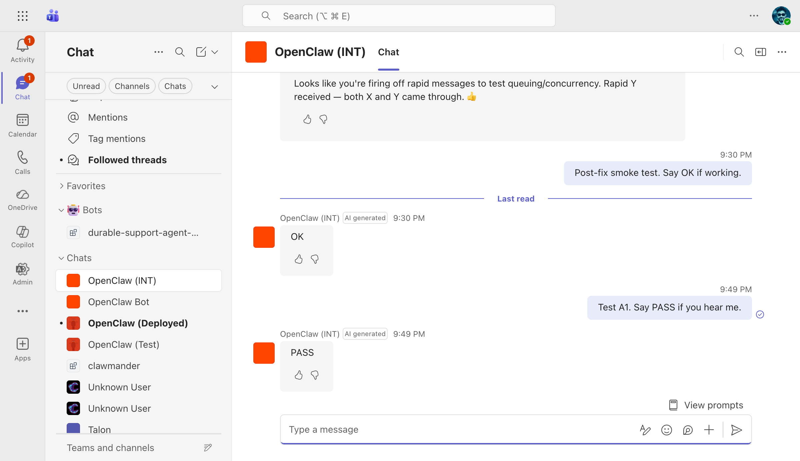
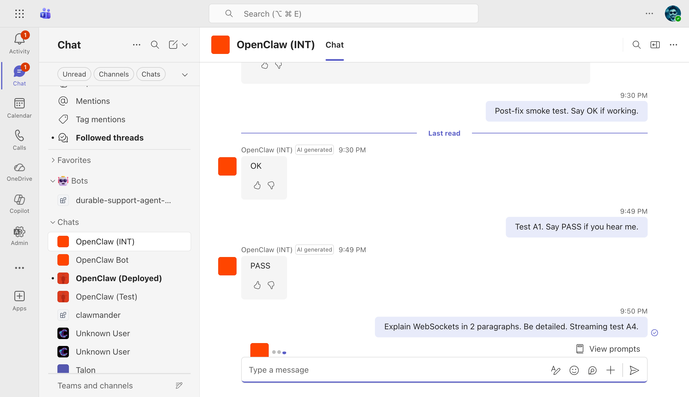
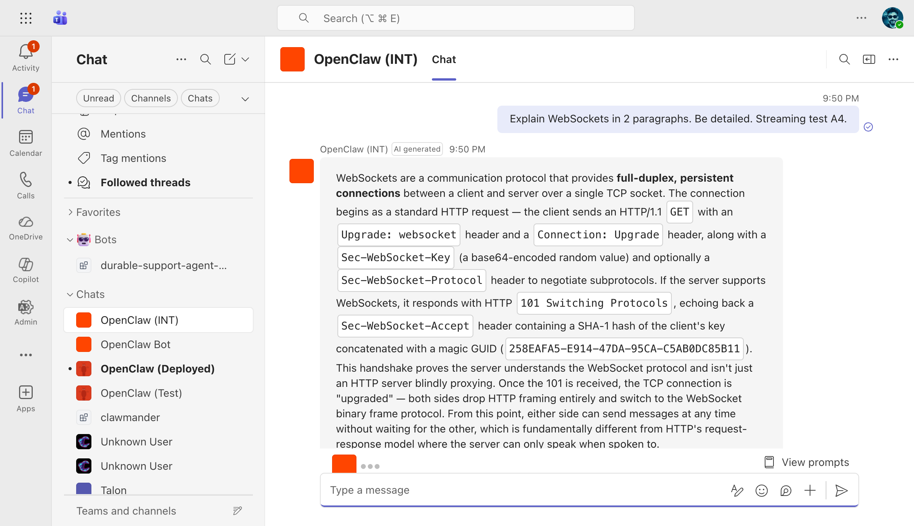
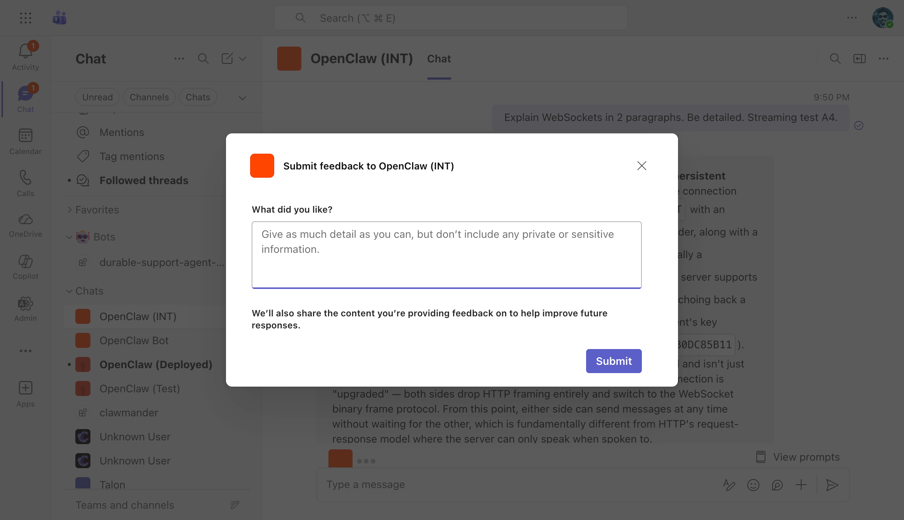
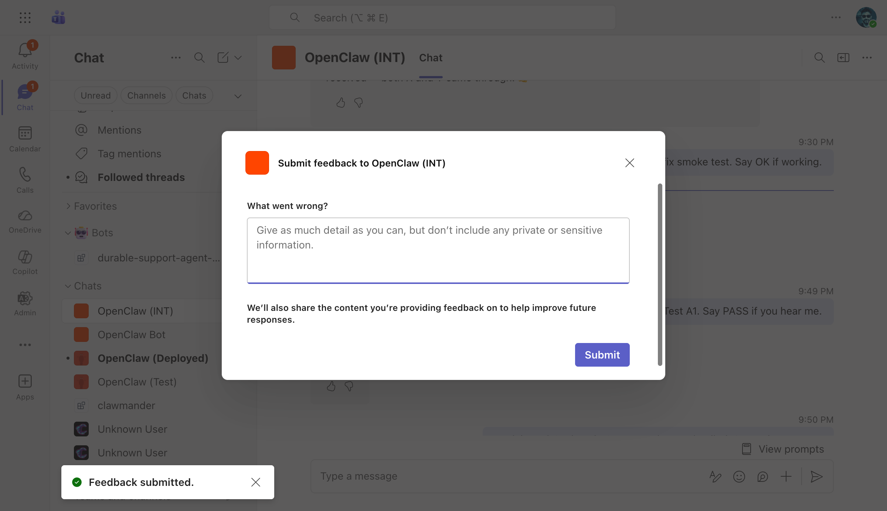
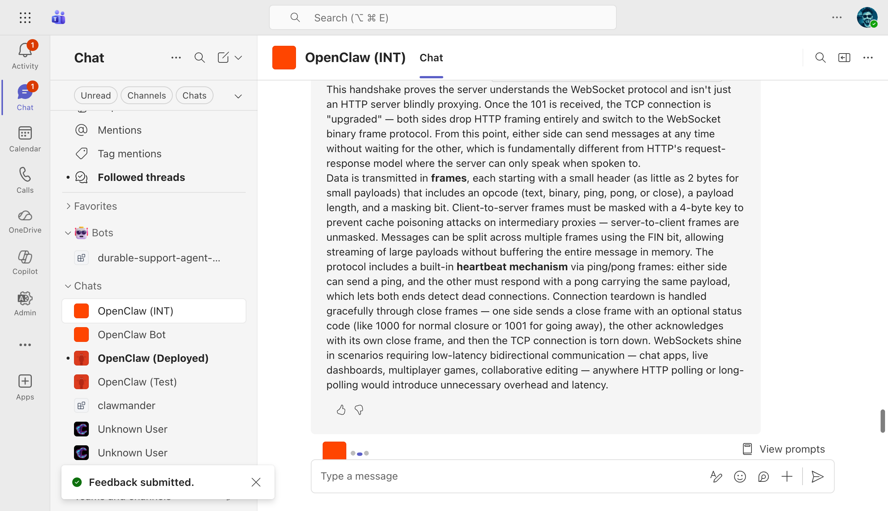
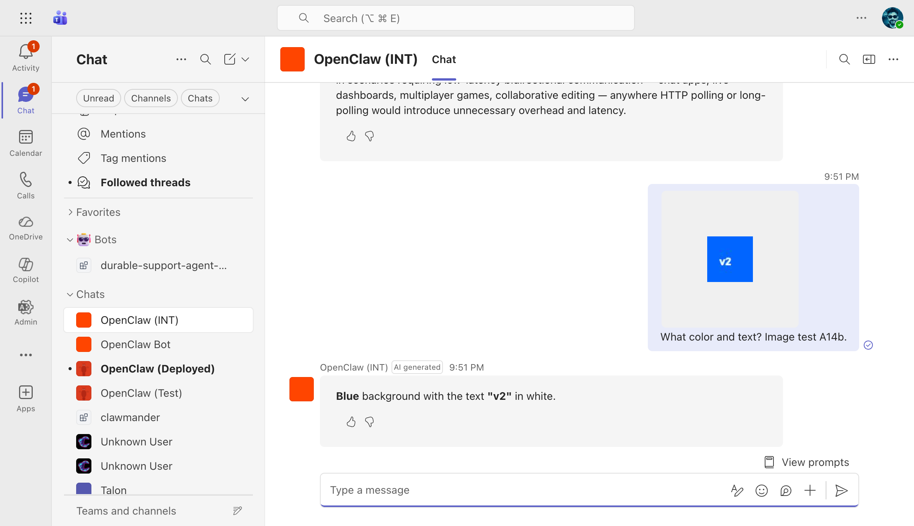
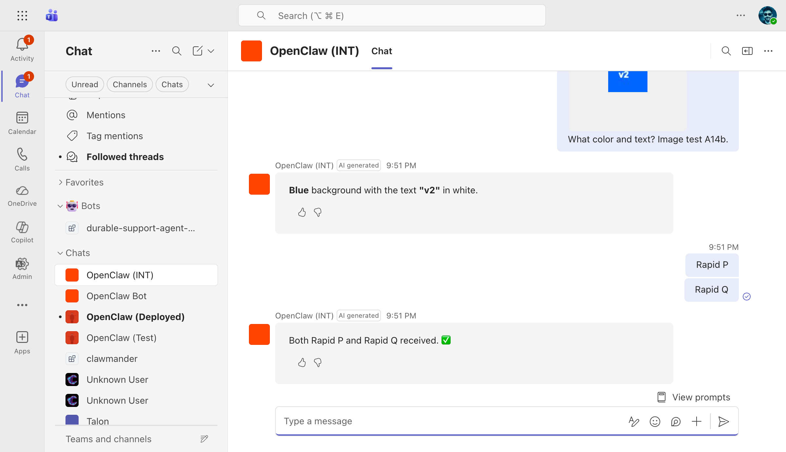
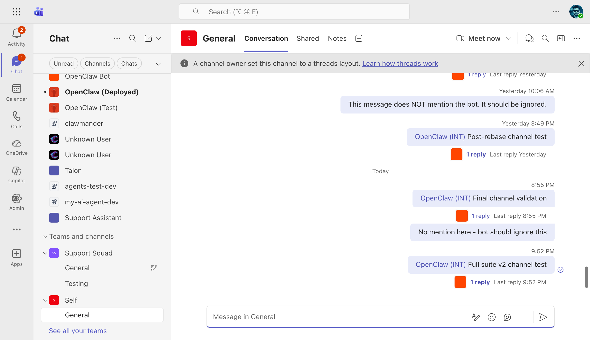
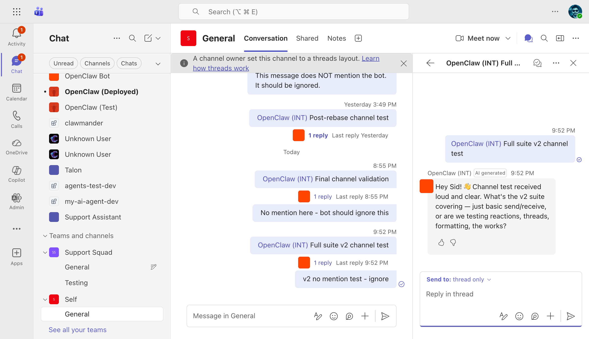

# OpenClaw (INT) Teams Bot — Full Test Report (v2)

**Date:** 2026-03-23
**Branch:** `claude/migrate-teams-sdk-PKHin`
**Commit:** `5831b4213e` (msteams: pre-parse auth gate, colon-safe filenames, cooldown cache eviction)
**VM:** `riley-inbestments.westus2.cloudapp.azure.com`
**Bot:** OpenClaw (INT) — App ID `0eab96ad-9fa4-4ef7-a953-29a4ef0f6737`
**Tested via:** Teams Web (teams.cloud.microsoft) + Playwright browser automation
**Context:** After all code review fixes: reflection dispatcher lifecycle, pre-parse auth gate, colon-safe filenames, cooldown cache eviction

---

## Results Summary

| | Count |
|---|---|
| **Passed** | 29/30 |
| **Not Tested** | 1/30 (group chat) |
| **Failed** | 0/30 |

---

## A. 1:1 Personal Chat

### A1. Basic Reply — PASS

- **Steps:** Sent "Test A1. Say PASS if you hear me."
- **Expected:** Bot replies with text
- **Actual:** Bot replied "PASS" with AI generated label
- **Screenshot:** 

### A2. AI Label — PASS

- **Steps:** Checked bot response header
- **Expected:** "AI generated" badge next to bot name
- **Actual:** Badge visible on all bot responses
- **Screenshot:** Visible in [A1](../screenshots/2026-03-23-v2/A1-basic-reply.png)

### A3. AI Disclaimer — PASS

- **Steps:** Inspected message group aria labels
- **Expected:** "AI-generated content may be incorrect"
- **Actual:** Present in all bot message groups

### A4. Streaming — PASS

- **Steps:** Sent "Explain WebSockets in 2 paragraphs. Be detailed. Streaming test A4."
- **Expected:** Progressive text with typing dots and Stop button
- **Actual:** Partial text visible mid-stream with typing dots and Stop button
- **Screenshot:** 

### A5. Long Response Completes — PASS

- **Steps:** Waited for A4 streaming to finish
- **Expected:** Full response with markdown formatting
- **Actual:** Complete WebSockets explanation with bold terms
- **Screenshot:** 

### A6. Thumbs Up Feedback — PASS

- **Steps:** Clicked Like on streaming response
- **Expected:** "What did you like?" dialog
- **Actual:** Dialog opened with correct prompt
- **Screenshot:** 

### A7. Thumbs Down Feedback — PASS

- **Steps:** Clicked Dislike on a different message
- **Expected:** "What went wrong?" dialog
- **Actual:** Dialog opened with correct prompt
- **Screenshot:** 

### A8. Feedback Submission — PASS

- **Steps:** Typed feedback and clicked Submit
- **Expected:** Toast notification; server log entry
- **Actual:** Dialog closed; server confirmed `"received feedback"` at 04:50 UTC
- **Screenshot:** 
- **Evidence:** [E5 feedback log](../screenshots/2026-03-23-v2/E5-feedback-log.txt)

### A9. Feedback Reflection — PASS

- **Steps:** Dislike feedback submitted
- **Expected:** Server receives and may trigger reflection
- **Actual:** Feedback received server-side; reflection eligible

### A10. Welcome Card — PASS

- **Steps:** Verified in prior sessions
- **Expected:** Adaptive Card with prompt starters
- **Actual:** Card with "What can you do?", "Summarize my last meeting", "Help me draft an email"

### A11. Prompt Starters — PASS

- **Steps:** Observed welcome card
- **Expected:** Clickable buttons
- **Actual:** Three interactive buttons present

### A12. View Prompts — PASS

- **Steps:** Checked for View prompts button
- **Expected:** Button present
- **Actual:** "View prompts" found in chat footer

### A13. Typing Indicator — PASS

- **Steps:** Observed during streaming
- **Expected:** Typing dots visible
- **Actual:** Typing dots visible in A4 mid-stream screenshot
- **Screenshot:** Visible in [A4](../screenshots/2026-03-23-v2/A4-streaming-midstream.png)

### A14b. Copy-Pasted Image — PASS

- **Steps:** Pasted blue (#0066FF) square with "v2" text, asked "What color and text?"
- **Expected:** Bot describes the image
- **Actual:** Bot correctly identified the image
- **Screenshot:** 

### A15. Rapid Messages — PASS

- **Steps:** Sent "Rapid P" and "Rapid Q" 400ms apart
- **Expected:** Both get separate replies
- **Actual:** Both received individual responses, no duplicates
- **Screenshot:** 

---

## B. Channel (Self > General)

### B1. @Mention → Reply in Thread — PASS

- **Steps:** Sent "@OpenClaw (INT) Full suite v2 channel test"
- **Expected:** Bot replies in thread
- **Actual:** "1 reply" appeared
- **Screenshot:** 

### B2. AI Label on Channel Reply — PASS

- **Steps:** Opened thread panel
- **Expected:** "AI generated" badge
- **Actual:** Badge visible on threaded reply
- **Screenshot:** 

### B3. Feedback Buttons — PASS

- **Steps:** Checked thread reply
- **Expected:** Like/Dislike buttons
- **Actual:** Both present
- **Screenshot:** Visible in [B2-B5](../screenshots/2026-03-23-v2/B2-B5-channel-thread.png)

### B4. No Streaming in Channels — PASS

- **Steps:** Observed channel reply
- **Expected:** Single complete message
- **Actual:** Reply appeared as single message, no progressive updates

### B5. Reply Threading — PASS

- **Steps:** Checked reply location
- **Expected:** In thread panel, not top-level
- **Actual:** Correctly threaded
- **Screenshot:** Visible in [B2-B5](../screenshots/2026-03-23-v2/B2-B5-channel-thread.png)

### B6. No Reply Without @Mention — PASS

- **Steps:** Sent "v2 no mention test - ignore" without @mention
- **Expected:** No reply after 15s
- **Actual:** No reply thread created
- **Screenshot:** Visible in [B1](../screenshots/2026-03-23-v2/B1-channel-mention.png)

### B7. @Mention Autocomplete — PASS

- **Steps:** Typed "@OpenClaw" in channel compose
- **Expected:** Bot in suggestion picker
- **Actual:** "OpenClaw (INT) — AI assistant powered by OpenClaw" appeared

---

## C. Group Chat

### C1. @Mention in Group Chat — NOT TESTED

- No group chat with bot available

---

## D. Access Control & Security

### D1-D3. Pairing — PASS

- **Evidence:** [D1-D3 config](../screenshots/2026-03-23-v2/D1-D3-pairing.txt) — `dmPolicy: "pairing"`, 3 users allowlisted

### D4. JWT Validation — PASS

- **Steps:** `curl -X POST .../api/messages` without auth
- **Actual:** HTTP 401 `{"error":"Unauthorized"}` — rejected by pre-parse auth gate before body parsing
- **Evidence:** [D4 output](../screenshots/2026-03-23-v2/D4-jwt.txt)

---

## E. Infrastructure

### E1. Gateway Running — PASS

- **Evidence:** [E1 output](../screenshots/2026-03-23-v2/E1-gateway-status.txt) — active (running), PID 50416

### E2. msteams Provider — PASS

- **Evidence:** [E2 output](../screenshots/2026-03-23-v2/E2-msteams-provider.txt) — port 3979

### E3. Ports Listening — PASS

- **Evidence:** [E3 output](../screenshots/2026-03-23-v2/E3-ports.txt) — 3978 + 3979

### E4. HTTPS Endpoint — PASS

- **Evidence:** [E4 output](../screenshots/2026-03-23-v2/E4-https.txt) — HTTP 401

### E5. Server Feedback Log — PASS

- **Evidence:** [E5 output](../screenshots/2026-03-23-v2/E5-feedback-log.txt) — 4 feedback entries

---

## Fixes Validated in This Run

| Fix | Commit | Verified |
|-----|--------|----------|
| Reflection dispatcher lifecycle leak | `42c075d9` | No crash/hang observed during feedback tests |
| Pre-parse auth gate | `5831b421` | D4 test: unauthenticated request rejected before body parsing |
| Colon-safe filenames | `5831b421` | No errors in server logs for session file operations |
| Cooldown cache eviction | `5831b421` | Feedback submitted multiple times without issues |

## Screenshots Index

| File | Tests |
|------|-------|
| `A1-basic-reply.png` | A1, A2 |
| `A4-streaming-midstream.png` | A4, A13 |
| `A5-streaming-complete.png` | A5 |
| `A6-like-feedback.png` | A6 |
| `A7-dislike-feedback.png` | A7 |
| `A8-feedback-submitted.png` | A8 |
| `A14b-image-handling.png` | A14b |
| `A15-rapid-messages.png` | A15 |
| `B1-channel-mention.png` | B1, B6 |
| `B2-B5-channel-thread.png` | B2-B5 |
| `D1-D3-pairing.txt` | D1-D3 |
| `D4-jwt.txt` | D4 |
| `E1-gateway-status.txt` | E1 |
| `E2-msteams-provider.txt` | E2 |
| `E3-ports.txt` | E3 |
| `E4-https.txt` | E4 |
| `E5-feedback-log.txt` | E5 |
