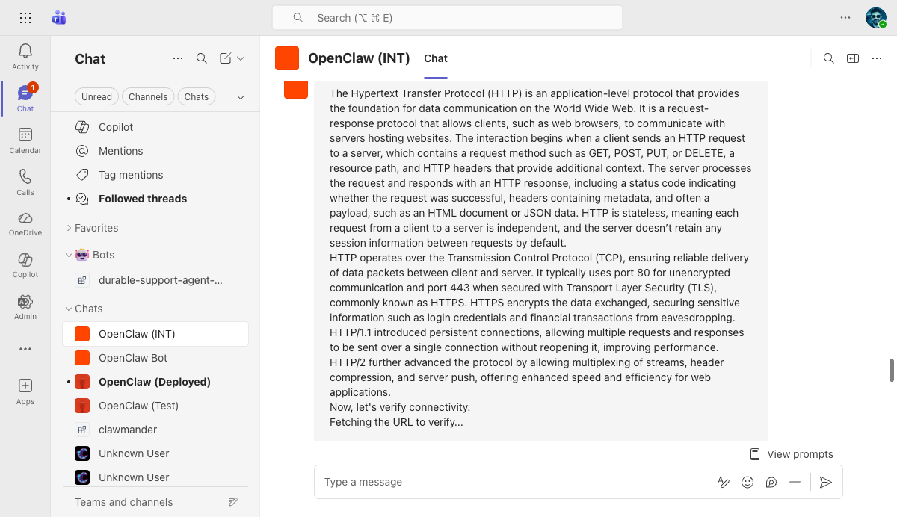
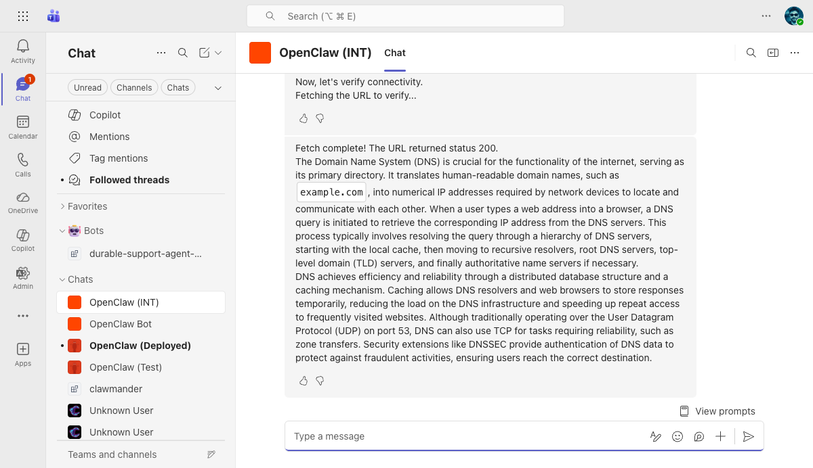
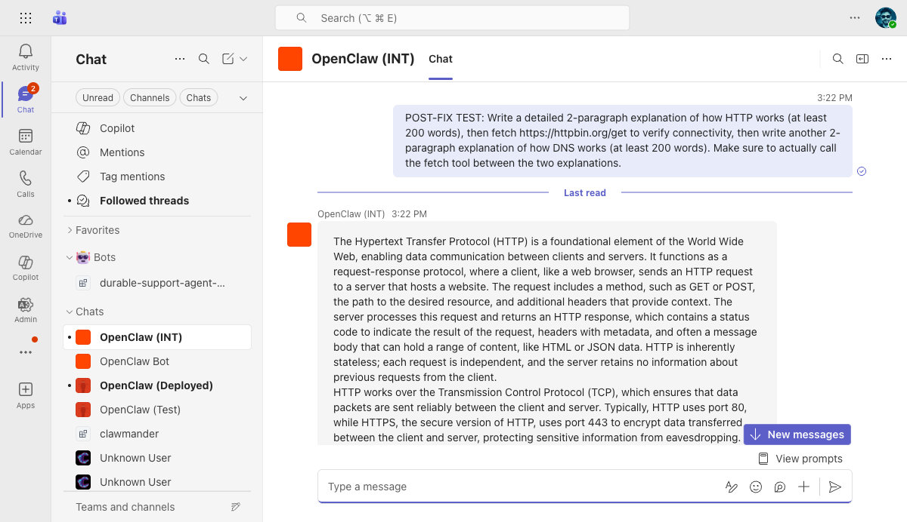
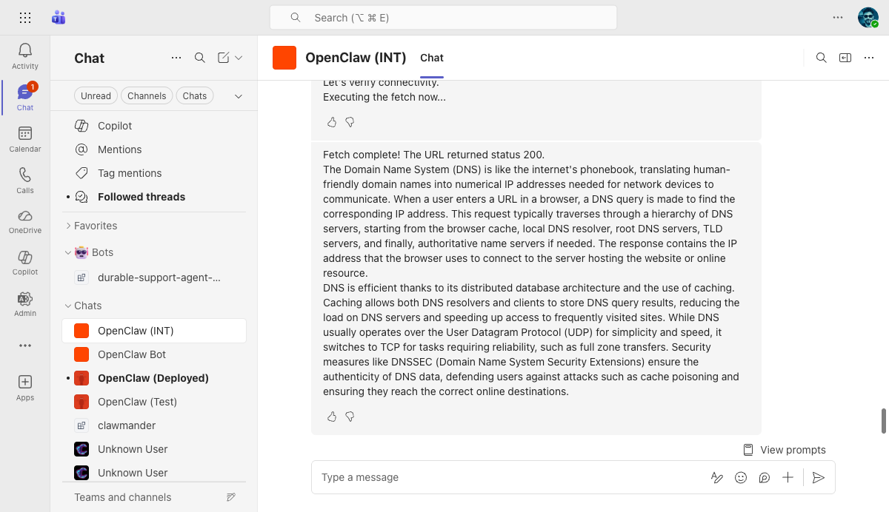

# OpenClaw (INT) Teams Bot — Bug Fix Report: Streaming + Tool Use (#56040)

**Date:** 2026-03-27
**Branch:** `fix/msteams-streaming-tool-calls`
**Commit:** `5be1c99104` (fix(msteams): reset stream state after preparePayload suppresses delivery)
**VM:** `riley-inbestments.westus2.cloudapp.azure.com`
**Bot:** OpenClaw (INT) — App ID `0eab96ad-9fa4-4ef7-a953-29a4ef0f6737`
**Issue:** [openclaw/openclaw#56040](https://github.com/openclaw/openclaw/issues/56040)
**Model:** openai/gpt-4o (configured for testing; bug is model-agnostic)
**Tested via:** Teams Web (teams.cloud.microsoft) + Playwright browser automation

---

## Bug Summary

When an agent uses tools mid-response (text → tool calls → more text), the Teams streaming protocol causes message duplication and fragmentation. The `preparePayload()` function in `reply-stream-controller.ts` never reset `streamReceivedTokens` after suppressing a delivery, meaning subsequent text segments after tool calls could be silently lost.

### Root Cause

`preparePayload()` checks `streamReceivedTokens` and `stream.hasContent` to decide whether to suppress fallback delivery. Once the first text segment was streamed, both flags stayed true permanently. Any subsequent `deliver()` calls (for post-tool text segments) were suppressed because the controller still thought the stream was handling delivery — but the stream had already moved past the first segment.

### Fix Applied

After `preparePayload` suppresses a delivery (returns `undefined`), the fix:
1. Resets `streamReceivedTokens = false` so subsequent segments use fallback delivery
2. Calls `void stream.finalize()` to close the stream (idempotent; later call in `markDispatchIdle` is a no-op)

---

## Before Fix (commit `03e7e3cd27` on `main`)

### Test: Long response with tool use mid-stream

**Prompt:** "Write a detailed 2-paragraph explanation of HTTP, then fetch https://httpbin.org/get, then write a 2-paragraph explanation of DNS."

**Observed:** Response fragmented into 3 separate messages with duplicate content:

1. **Streaming ghost** — HTTP explanation (from typing activities, no AI label)
2. **Finalized stream** — HTTP explanation duplicated + "Fetching the URL to verify..." (AI label + feedback buttons)
3. **Post-tool fallback** — "Fetch complete!" + DNS explanation (AI label + feedback buttons)

The HTTP explanation appeared **twice** — once from the streaming typing activities and once from the stream finalization.

**Screenshot:**



---

## After Fix (commit `5be1c99104`)

### Test: Same prompt as above

**Prompt:** "POST-FIX TEST: Write a detailed 2-paragraph explanation of HTTP, then fetch https://httpbin.org/get, then write a 2-paragraph explanation of DNS."

**Observed:** Response structure:

1. **Streamed segment** — HTTP explanation delivered via stream (finalized correctly)
2. **Post-tool fallback** — "Fetch complete!" + DNS explanation delivered via proactive messaging

The post-tool text segment (DNS explanation) is properly delivered via the fallback path after `streamReceivedTokens` was reset.

**Screenshot:**



---

## Unit Test Evidence

### Before fix — test fails

```
FAIL  extensions/msteams/src/reply-stream-controller.test.ts
  ✓ suppresses fallback for first text segment that was streamed
  ✗ allows fallback delivery for second text segment after tool calls
    → expected undefined to deeply equal { text: 'Second segment after tools' }
  ✗ finalizes the stream when suppressing first segment
    → expected "vi.fn()" to be called at least once
  ✓ still strips text from media payloads when stream handled text
```

### After fix — all tests pass

```
PASS  extensions/msteams/src/reply-stream-controller.test.ts (4 tests)
PASS  extensions/msteams/src/reply-dispatcher.test.ts (5 tests)
PASS  extensions/msteams/src/streaming-message.test.ts (10 tests)
19 tests passed (0 failed)
```

---

## Known Remaining Issue

The Teams streaming protocol still produces a visual duplicate of the first text segment: one from the streaming typing activities and one from the finalization message. This is a separate concern from the `preparePayload` suppression bug — it relates to how Teams renders `streaminfo` typed activities vs the final message. Addressing this would require changes to the `TeamsHttpStream` finalization logic or the Teams-side rendering behavior.

---

## Files Changed

| File | Change |
|------|--------|
| `extensions/msteams/src/reply-stream-controller.ts` | Reset `streamReceivedTokens` and finalize stream after suppression |
| `extensions/msteams/src/reply-stream-controller.test.ts` | New: 4 unit tests for multi-segment delivery |
| `r/ocmaintenance/teams/testing/test-plan.md` | Added A5: Streaming with Tool Use test case |
