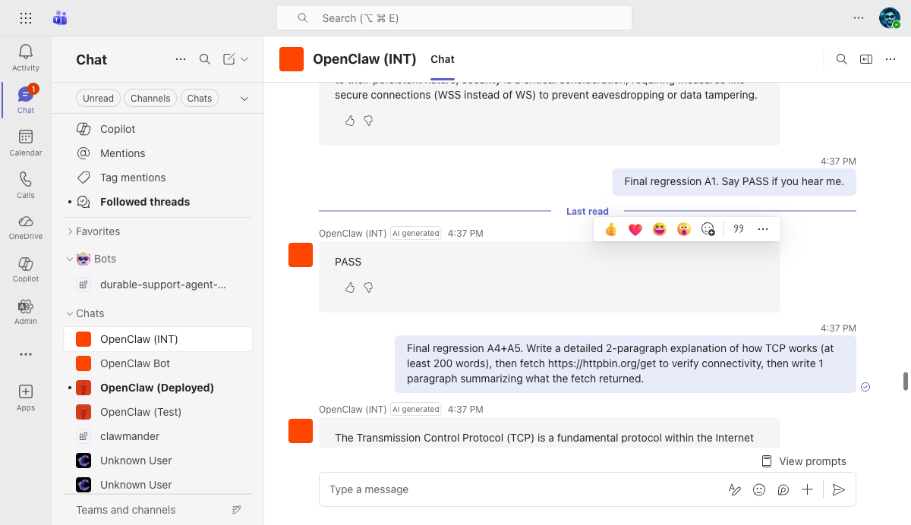
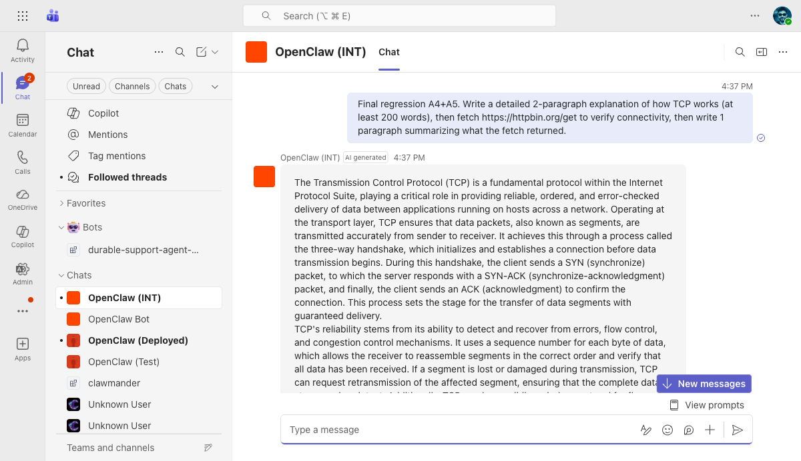
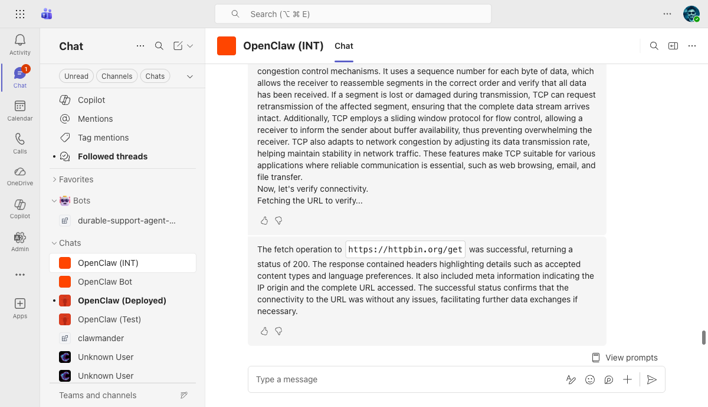
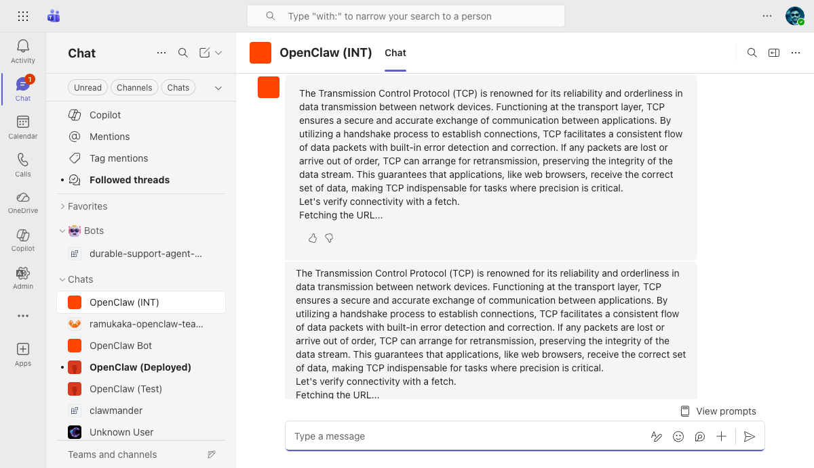

# OpenClaw (INT) Teams Bot — Regression Test Report

**Date:** 2026-03-27
**Branch:** `fix/msteams-streaming-tool-calls`
**Commit:** `31af10ebda` (test(msteams): add edge case tests for multi-round and media payloads)
**VM:** `riley-inbestments.westus2.cloudapp.azure.com`
**Bot:** OpenClaw (INT) — App ID `0eab96ad-9fa4-4ef7-a953-29a4ef0f6737`
**Model:** openai/gpt-4o
**Tested via:** Teams Web (teams.cloud.microsoft) + Playwright browser automation
**Context:** Final regression after review feedback fix (added `stream.isFinalized` guard)

---

## Results Summary

| | Count |
|---|---|
| **Passed** | 5/5 |
| **Failed** | 0/5 |

---

## A. 1:1 Personal Chat

### A1. Basic Reply — PASS

- **Steps:** Sent "Final regression A1. Say PASS if you hear me."
- **Expected:** Bot replies with text
- **Actual:** Bot replied "PASS" with AI generated label and Like/Dislike buttons
- **Screenshot:** 

### A4. Streaming (Progressive Updates) — PASS

- **Steps:** Sent "Final regression A4+A5. Write a detailed 2-paragraph explanation of how TCP works (at least 200 words), then fetch https://httpbin.org/get to verify connectivity, then write 1 paragraph summarizing what the fetch returned."
- **Expected:** Text appears progressively with typing indicator and Stop button
- **Actual:** TCP explanation streamed progressively with Stop button and "OpenClaw (INT) is typing" visible
- **Screenshot:** 

### A5. Streaming with Tool Use (Multi-Segment) — PASS

- **Steps:** Same prompt as A4 — triggers web_fetch tool between text segments
- **Expected:** Both pre-tool and post-tool text delivered. No content silently lost.
- **Actual:** TCP explanation delivered via stream, then "The fetch operation to `https://httpbin.org/get` was successful, returning a status of 200..." delivered via fallback as a separate message with AI label and feedback buttons.
- **Screenshot:** 

### Edge Case: 3+ Tool Call Rounds (text → tool → text → tool → text) — PASS

- **Steps:** Sent "Write one paragraph about TCP, then fetch https://httpbin.org/get, then write one paragraph about UDP, then fetch https://httpbin.org/ip, then write one paragraph about ICMP."
- **Expected:** All 5 text segments delivered (TCP, fetch result 1, UDP, fetch result 2, ICMP). No content lost across 3 rounds.
- **Actual:** All segments delivered. TCP streamed, then UDP + fetch result delivered via fallback, then ICMP + IP fetch result delivered via fallback. Each message has AI label and feedback buttons.
- **Screenshot:** 

---

## E. Infrastructure

### E4. HTTPS Endpoint Reachable — PASS

- **Steps:** `curl -s -o /dev/null -w "%{http_code}" -X POST https://riley-inbestments.westus2.cloudapp.azure.com/api/messages -H "Content-Type: application/json" -d '{}'`
- **Expected:** 401
- **Actual:** 401
